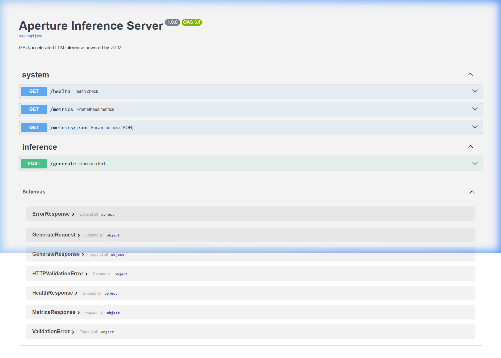
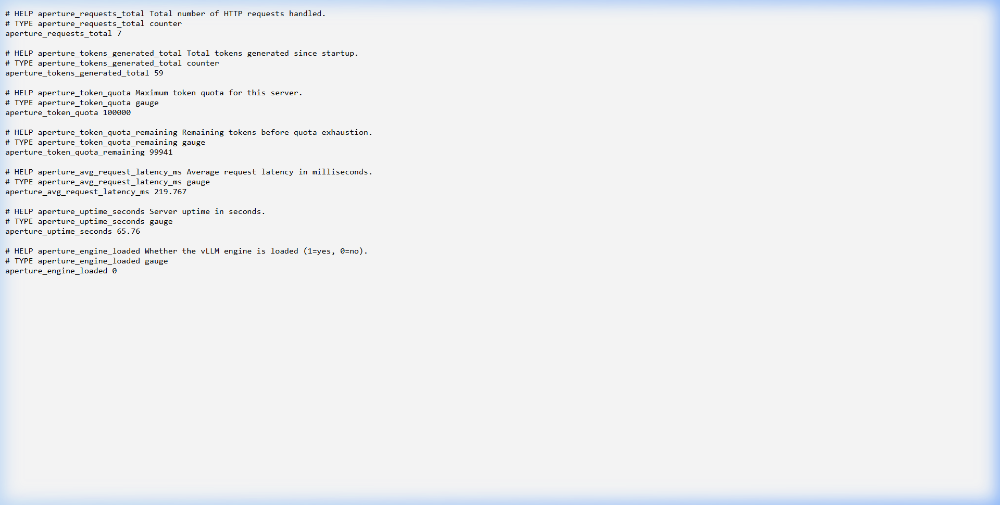
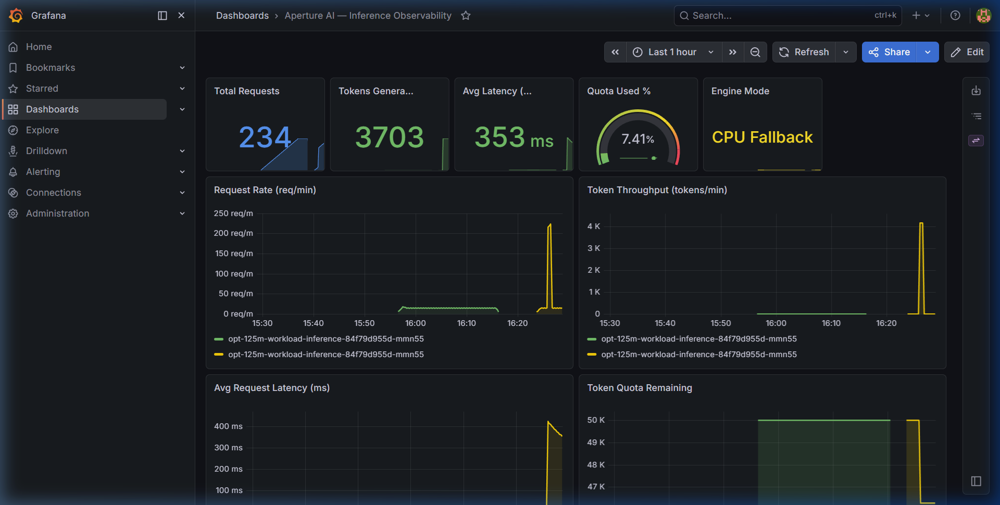

# Aperture — AI-Native GPU Inference Orchestrator

Production-grade Kubernetes platform for dynamically scheduling GPU workloads and serving LLM inference at scale.

## Architecture

```
┌─────────────────────────────────────────────────────────────────┐
│                    Kubernetes Cluster                            │
│                                                                 │
│  ┌──────────────────┐     ┌──────────────────────────────────┐  │
│  │  Aperture Operator│     │  Inference Pods (per workload)   │  │
│  │  (Go / ctrl-rt)  │────▶│  ┌────────────┐ ┌────────────┐  │  │
│  │                   │     │  │ Init: Model │ │  vLLM +    │  │  │
│  │  • Reconciler     │     │  │ Pre-loader  │ │  FastAPI   │  │  │
│  │  • Webhook        │     │  └──────┬──────┘ └──────┬─────┘  │  │
│  │  • Status Mgmt    │     │         │ PVC           │ :8080  │  │
│  └──────────────────┘     │  ┌──────▼──────┐  ┌─────▼──────┐ │  │
│                            │  │ Model Cache │  │  ClusterIP │ │  │
│  ┌──────────────────┐     │  │  (50Gi PVC) │  │  Service   │ │  │
│  │  Prometheus       │◀───│  └─────────────┘  └────────────┘ │  │
│  │  + Grafana        │     └──────────────────────────────────┘  │
│  └──────────────────┘                                           │
└─────────────────────────────────────────────────────────────────┘
```

## Components

| Component | Language | Location | Purpose |
|-----------|----------|----------|---------|
| **Operator** | Go | `operator/` | CRD controller managing GPUWorkload lifecycle |
| **Inference Server** | Python | `inference/` | vLLM-backed FastAPI server with continuous batching |
| **K8s Manifests** | YAML | `k8s/` | CRDs, RBAC, HPA, monitoring, PDB, model cache |

## Quick Start

### Prerequisites

- Kubernetes 1.28+ with GPU nodes
- NVIDIA device plugin installed
- cert-manager (for webhook TLS)
- Docker or Podman

### 1. Build Images

```bash
# Operator
cd operator && docker build -t aperture-operator:latest .

# Inference server
cd inference && docker build -t aperture-inference:latest .
```

### 2. Deploy

```bash
# CRD + RBAC + Operator
kubectl apply -f operator/config/crd.yaml
kubectl apply -f operator/config/rbac.yaml
kubectl apply -f operator/config/deployment.yaml

# Webhook (requires cert-manager)
kubectl apply -f k8s/webhook.yaml

# Model cache PVC
kubectl apply -f k8s/model-cache.yaml

# Monitoring (requires kube-prometheus-stack)
kubectl apply -f k8s/monitoring.yaml
kubectl apply -f k8s/pdb.yaml
```

### 3. Create a Workload

```bash
kubectl apply -f k8s/gpuworkload-sample.yaml
kubectl get gpuworkloads -w
```

### 4. Send Inference Requests

```bash
# Get the service IP
SVC_IP=$(kubectl get svc opt-125m-workload-svc -o jsonpath='{.spec.clusterIP}')

# Generate text
curl -X POST http://$SVC_IP:8080/generate \
  -H "Content-Type: application/json" \
  -d '{"prompt": "Explain attention mechanisms", "max_tokens": 100}'
```

## GPUWorkload Custom Resource

```yaml
apiVersion: aperture.ai/v1alpha1
kind: GPUWorkload
metadata:
  name: my-workload
spec:
  modelName: facebook/opt-125m   # HuggingFace model ID
  gpu: 1                         # GPUs to allocate (1-8)
  partitionMode: MPS             # MPS or MIG
  tokenQuota: 50000              # Max tokens before throttling
  kvCacheGB: 4                   # KV cache size for paged attention
```

## API Endpoints

| Endpoint | Method | Description |
|----------|--------|-------------|
| `/generate` | POST | Generate text from prompt |
| `/health` | GET | Engine status + uptime |
| `/metrics` | GET | Prometheus text exposition |
| `/metrics/json` | GET | JSON metrics for dashboards |
| `/openapi.json` | GET | OpenAPI schema |

### Interactive API Documentation



For a complete set of endpoint verification screenshots, see [SCREENSHOTS.md](SCREENSHOTS.md).

## Observability

- **Prometheus**: ServiceMonitor auto-discovers inference pods (`k8s/monitoring.yaml`)
- **Grafana**: 12-panel dashboard (`k8s/grafana-dashboard.json`)
- **Alerts**: Inference down, quota near limit, high latency
- **Tracing**: OpenTelemetry → OTLP (Jaeger/Tempo), opt-in via `OTEL_ENABLED=true`
- **Logging**: JSON-structured to stdout for Fluentd/Loki

#### Local Prometheus Metrics Exposition



#### Grafana Observability Dashboard



## Autoscaling

HPA scales on CPU utilization (built-in) and GPU utilization (via prometheus-adapter + DCGM exporter):

```bash
kubectl apply -f k8s/hpa.yaml
```

## Benchmarking

```bash
cd inference/benchmarks

# Time to first token
python ttft_measure.py --url http://<svc-ip>:8080 --runs 20

# Concurrent load test (10/50/100 users)
python load_test.py --url http://<svc-ip>:8080
```

Results saved to `inference/benchmarks/results/`.

## Security

- Non-root containers (`USER aperture` / UID 65532)
- `readOnlyRootFilesystem: true`
- `capabilities: drop: ALL`
- Pod Security Admission: `restricted` profile
- NetworkPolicy: egress limited to DNS + HTTPS
- RBAC: scoped ClusterRole per component

## Testing

```bash
# Python (inference server)
cd inference && pytest test_server.py -v

# Go (webhook validation)
cd operator && go test ./api/v1alpha1/ -v
```

## Project Structure

```
aperture-ai/
├── operator/                       # Go Kubernetes Operator
│   ├── api/v1alpha1/               # CRD types + webhook + tests
│   ├── controllers/                # Reconciliation loop
│   ├── config/                     # CRD, RBAC, Deployment manifests
│   ├── Dockerfile                  # Distroless operator image
│   ├── main.go                     # Entry point
│   └── go.mod
├── inference/                      # Python Inference Server
│   ├── server.py                   # FastAPI + vLLM
│   ├── tracing.py                  # OpenTelemetry integration
│   ├── model_preloader.py          # Init container model downloader
│   ├── test_server.py              # Unit tests (23 tests)
│   ├── Dockerfile                  # CUDA 12.1 GPU image
│   ├── requirements.txt
│   └── benchmarks/                 # TTFT + load test scripts
├── k8s/                            # Kubernetes Manifests
│   ├── gpuworkload-sample.yaml     # Sample CR
│   ├── webhook.yaml                # ValidatingWebhookConfiguration
│   ├── monitoring.yaml             # ServiceMonitor + PrometheusRule
│   ├── grafana-dashboard.json      # Grafana dashboard
│   ├── hpa.yaml                    # HorizontalPodAutoscaler
│   ├── pdb.yaml                    # PodDisruptionBudget
│   └── model-cache.yaml            # PVC for model weights
└── README.md
```

## License

Proprietary — Aperture AI
