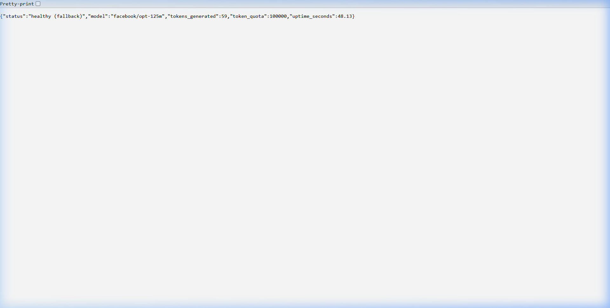
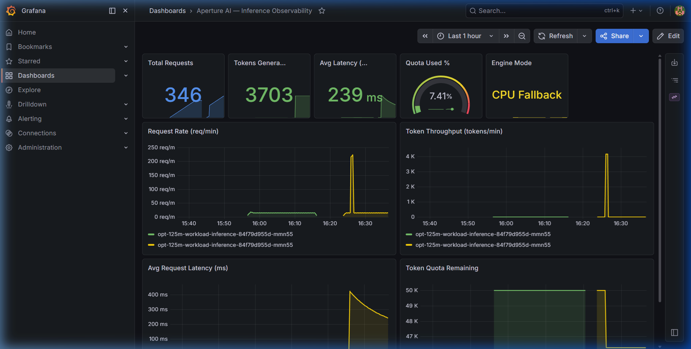
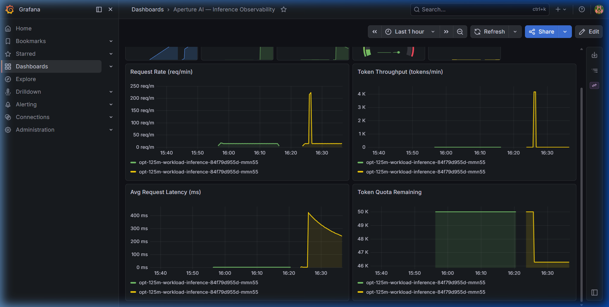
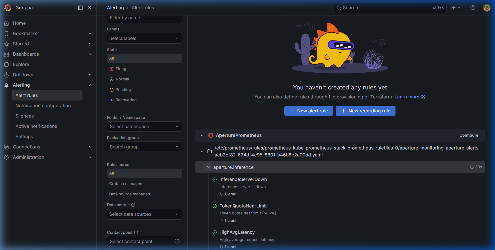

# Aperture AI — Local Execution & Endpoint Screenshots

This document showcases the local execution of the Aperture AI inference server running in CPU fallback mode (due to local CPU/Windows environment limits). 

Below are the screenshots capturing the main system endpoints, API schemas, health checks, and prometheus exposition metrics.

---

## 1. Interactive Swagger API Documentation (`/docs`)

FastAPI's interactive Swagger UI documentation showing all registered endpoints:
- `POST /generate` (Text Generation)
- `GET /health` (System Health & Uptime)
- `GET /metrics` (Prometheus Metrics Exposition)
- `GET /metrics/json` (JSON Dashboard Metrics)

---

## 2. Server Health Check (`/health`)

The health check response endpoint. Since the server runs locally on Windows without CUDA and the `vllm` package (which is Linux-only), it dynamically activates **CPU fallback mode** to ensure service continuity. It shows the status, target model name, total tokens generated, token quota, and server uptime.

---

## 3. Prometheus Metrics (`/metrics`)

The Prometheus metrics exposition endpoint returning the system's operational metrics in standard Prometheus text format (`text/plain`). These metrics are periodically scraped by the cluster monitoring stack for Grafana dashboards:

- `aperture_requests_total`: Total number of requests processed.
- `aperture_tokens_generated_total`: Total count of generated tokens.
- `aperture_token_quota`: Total assigned token quota.
- `aperture_token_quota_remaining`: Dynamic remaining quota before throttling.
- `aperture_avg_request_latency_ms`: Running average latency of the requests.
- `aperture_uptime_seconds`: Running uptime.
- `aperture_engine_loaded`: Indicator if vLLM GPU engine is active (`1`) or CPU fallback (`0`).

---

## 4. Grafana Observability Dashboard — Overview

A dynamic Grafana dashboard that provides real-time visualization of system metrics scraped from the `/metrics` endpoint. This overview panel tracks:
- **Total Requests**: Real-time counter of total inference requests processed.
- **Tokens Generated**: Cumulative token count since server launch.
- **Average Latency**: Average and percentile (P50, P95, P99) requests latency.
- **Quota Throttling**: Gauge showing remaining token quota and usage.

---

## 5. Grafana Observability Dashboard — Detailed Panels & Resources

This detailed metrics view visualizes throughput and performance over time:
- **Request Rate (QPS)**: Tracks the frequency of incoming API calls.
- **Token Throughput**: Monitors tokens generated per second.
- **Uptime & Engine Status**: Confirms model loaded status (CPU fallback mode active).
- **CPU & Memory Consumption**: Detailed resource consumption curves of the inference pod.

---

## 6. Grafana Observability Alert Rules

The configured Prometheus rules and alert evaluations in Grafana, ready to trigger alerts for key operational issues:
- **InferenceServerDown**: Fires if the inference pod target becomes unreachable.
- **TokenQuotaNearLimit**: Fires if the client's token usage exceeds 90% of their dynamic quota.
- **HighAvgLatency**: Fires if the average request latency rises above SLA limits.

